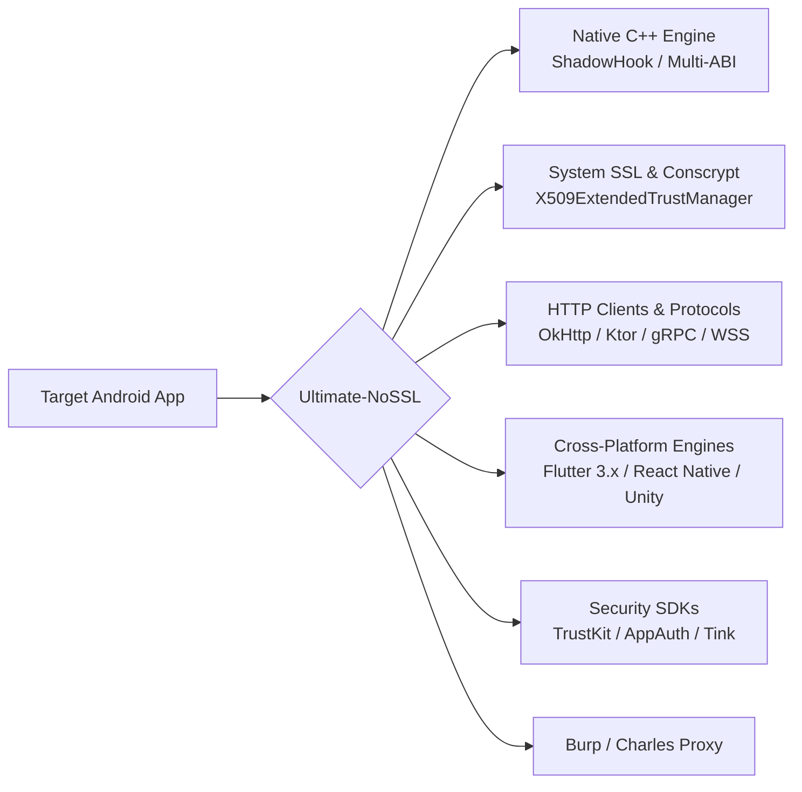

# 🔓 Ultimate-NoSSL: Universal Android SSL Pinning Bypass Engine

<p align="center">
  
  
  
  
</p>

**Ultimate-NoSSL** is a high-performance, universal Android Xposed module engineered to bypass SSL/TLS certificate pinning, custom trust managers, and certificate verification mechanisms across all layers of the Android OS. 

Designed specifically for security researchers, reverse engineers, and mobile penetration testers, it ensures transparent traffic inspection in proxy tools like **Burp Suite, Charles Proxy, mitmproxy, and Fiddler** without triggering connection drops or application crashes.

---

## 🌟 Key Architecture & Capabilities



### 1. ⚡ Multi-ABI Native Engine (`nossl.cpp`)
- **Dynamic Memory Signature Scanner**: Scans executable memory maps (`/proc/self/maps`) to locate and patch un-exported verification routines in `libflutter.so`, `libssl.so`, `libcrypto.so`, and `libcronet.so`.
- **Flutter 3.x+ Support**: Advanced byte pattern matching covering Flutter 2.x, 3.0 up to 3.24+ (`session_verify_cert_chain`, `ssl_crypto_x509_session_verify_cert_chain`).
- **Dynamic `dlopen` Interception**: Captures late-loaded shared libraries (`libliger.so`, `libproxygen.so`, `libfb.so`, `libfizz.so`) and deploys native hooks immediately upon load.
- **Strict Memory Safety**: Compliant with Android 10-15 $W^{\wedge}X$ memory protection and dual page size alignment (4KB and 16KB).

### 2. 🛡️ System & Framework Layer
- **Universal TrustAll Engine (`SSLFactory.kt`)**: Injects extended `X509ExtendedTrustManager` implementations supporting modern Android Conscrypt, Chromium, and Apache Harmony signatures.
- **Dynamic Dummy Certificate Synthesizer (`CertSynthesizer.kt`)**: Synthesizes valid X.509 certificate chains in-memory to prevent `NullPointerException` crashes in strict banking/financial apps.
- **Network Security Config Bypass**: Neutralizes XML PinSets on Android 7.0+ (API 24+).

### 3. 🌐 Modern HTTP Clients & Protocols
- **OkHttp (v2, v3, v4)**: Empties pinned key hashes, disables `CertificatePinner.check()`, and neutralizes `CertificateChainCleaner`.
- **Kotlin Multiplatform Ktor (`KtorHook.kt`)**: Intercepts `OkHttpConfig`, `AndroidEngineConfig`, and `CIOEngineConfig`.
- **gRPC Channels (`GrpcHook.kt`)**: Injects unsafe SSL configurations into `OkHttpChannelBuilder`, `NettyChannelBuilder`, and `CronetChannelBuilder`.
- **WebSockets Secure (`WebSocketHook.kt`)**: Hooks `Java-WebSocket` and `nv-websocket-client` for `wss://` encrypted streams.
- **Retrofit & Fuel (`ModernHttpHook.kt`)**: Injects unsafe sockets into `Retrofit.Builder` and `FuelManager`.

### 4. 🧩 Cross-Platform & Hybrid Support
- **Flutter / Dart Engine**: Native AOT memory patcher for Dart VM SSL verification.
- **React Native / Hermes**: Injects `OkHttpClientProvider` and `CustomClientBuilderFactory`.
- **WebView / Cordova / Ionic**: Auto-proceeds on SSL validation errors (`SslErrorHandler.proceed()`).
- **Xamarin (.NET Mono)** & **Unity 3D WebRequest**.
- **Specialized Security SDKs**: Bypasses `TrustKit Android`, `OpenID AppAuth`, `AppClarity`, and `Google Tink`.

---

## 📊 Supported Frameworks & Matrix

| Framework / Library | Interception Level | Supported Versions |
|:---|:---:|:---:|
| **Standard Java / Android SSL** | Framework / Reflection | Android 7.0 - 15 (API 24 - 35) |
| **Conscrypt / BoringSSL** | Native / Java | Android Default & GMS Bundled |
| **OkHttp** | Bytecode Hook | OkHttp 2.x, 3.x, 4.x |
| **Flutter / Dart VM** | Native Memory Scanner | Flutter 1.x, 2.x, 3.0 - 3.24+ |
| **React Native (Hermes / JSC)** | Java / Bridge | React Native 0.60+ |
| **Ktor HTTP Client** | Framework (KMP) | Ktor 1.x, 2.x, 3.x |
| **gRPC Channels** | Java / Netty | gRPC Java 1.x+ |
| **WebSocket (WSS)** | Framework | Java-WebSocket / nv-ws |
| **Chromium Cronet** | Native / Java | Modern Google Play Services |
| **TrustKit Android** | SDK Hook | All Versions |
| **AppAuth Android** | SDK Hook | OpenID AppAuth 0.7+ |
| **Meta Liger / Proxygen / Fizz** | Native C++ Hook | Facebook, Instagram, Messenger |

---

## 🚀 Installation & Setup

1. **Prerequisites**:
   - Rooted Android device running Android 7.0+ (Nougat through 15).
   - [LSPosed](https://github.com/LSPosed/LSPosed) or [EdXposed] framework installed and active.
2. **Installation**:
   - Clone and build the project, or download the latest Release APK.
   - Install the APK on your device.
3. **Activation in LSPosed**:
   - Open **LSPosed Manager**.
   - Navigate to **Modules** $\rightarrow$ Enable **Ultimate-NoSSL**.
   - Select your target applications in the scope list.
   - Force-stop and restart the target application.
4. **Proxy Configuration**:
   - Set up your HTTP/HTTPS proxy (e.g., Burp Suite listening on port 8080).
   - Configure Wi-Fi proxy settings on the device.
   - Inspect all decrypted HTTPS traffic effortlessly.

---

## 🛠️ Building from Source

```bash
# Clone the repository
git clone https://github.com/Kero309x/Ultimate-NoSsl.git
cd Ultimate-NoSsl

# Run Unit Tests
./gradlew test

# Assemble Release APK
./gradlew assembleRelease
```

---

## ⚖️ Disclaimer

This tool is created strictly for **authorized security testing, API auditing, educational purposes, and reverse engineering research**. Users are solely responsible for ensuring compliance with applicable laws and permissions before analyzing third-party applications.
