<div align="center">

# 🔓 Ultimate-NoSSL
### *Universal Android SSL/TLS Pinning Bypass & Network Inspection Engine*

[-3DDC84?style=for-the-badge&logo=android&logoColor=white)](https://developer.android.com)
[](https://github.com/Kero309x/Ultimate-NoSsl)
[](https://github.com/LSPosed/LSPosed)
[](https://github.com/Kero309x/Ultimate-NoSsl/actions)
[](LICENSE)

<br/>

[📖 Overview](#-overview) •
[🏛️ Architecture](#-system-architecture) •
[⚡ Key Features](#-key-features) •
[📊 Supported Matrix](#-supported-matrix) •
[🚀 Quick Start](#-quick-start) •
[🛠️ Build Guide](#️-build-guide) •
[⚖️ Disclaimer](#️-disclaimer)

---

</div>

## 📖 Overview

**Ultimate-NoSSL** is an enterprise-grade, universal Android Xposed framework module engineered to neutralize all forms of SSL/TLS certificate pinning, custom certificate validation, and anti-proxy barriers in modern Android applications.

Unlike traditional pinning bypass tools that rely exclusively on standard Java reflection, **Ultimate-NoSSL** operates across a **hybrid multi-layer engine** combining low-level Native C++ memory signature patching, dynamic `dlopen` interception, and extended Java security managers.

### 🎯 Primary Use Cases
* **Mobile Penetration Testing & API Auditing**: Transparently intercept encrypted HTTPS/WSS/gRPC traffic inside **Burp Suite, Charles Proxy, mitmproxy, and Fiddler**.
* **Reverse Engineering Research**: Inspect internal endpoints of obfuscated apps, Flutter binaries, and React Native bundles without triggering `SSLHandshakeException` or connection aborts.
* **Network Reliability**: Prevent crash loops on OEM ROMs (Samsung OneUI, Xiaomi HyperOS, OnePlus OxygenOS) via LRU-cached safe reflection.

---

## 🏛️ System Architecture

```mermaid
graph TD
    classDef native fill:#1E1E2E,stroke:#89B4FA,stroke-width:2px,color:#CDD6F4;
    classDef framework fill:#181825,stroke:#A6E3A1,stroke-width:2px,color:#CDD6F4;
    classDef network fill:#11111B,stroke:#F9E2AF,stroke-width:2px,color:#CDD6F4;
    classDef proxy fill:#313244,stroke:#F38BA8,stroke-width:2px,color:#CDD6F4;

    App["📱 Target Application (Process Fork)"] --> Zygote["Zygote / LSPosed Dispatcher"]
    
    subgraph NativeLayer ["⚡ Phase 1: Native C++ Engine (libnossl.so)"]
        Zygote --> Native["ShadowHook & W^X Memory Patcher"]:::native
        Native --> Flutter["Flutter 3.x+ AOT Memory Scanner"]:::native
        Native --> Boring["BoringSSL & OpenSSL Trampolines"]:::native
        Native --> LateLoad["Dynamic dlopen Hook (Liger / Proxygen / Cronet)"]:::native
    end

    subgraph FrameworkLayer ["🛡️ Phase 2: System & Framework Security"]
        Zygote --> SysSSL["SSLFactory (X509ExtendedTrustManager)"]:::framework
        SysSSL --> Conscrypt["Conscrypt TrustManagerImpl Neutralizer"]:::framework
        SysSSL --> NSC["NetworkSecurityConfig XML Bypass"]:::framework
        SysSSL --> DummyCert["CertSynthesizer (Dynamic X.509 Chaining)"]:::framework
    end

    subgraph ProtocolLayer ["🌐 Phase 3: HTTP Clients & High-Level Protocols"]
        Zygote --> Clients["Protocol Dispatcher"]:::network
        Clients --> OkHttp["OkHttp 2.x, 3.x, 4.x & CertificatePinner"]:::network
        Clients --> Ktor["Ktor HTTP Client (KMP OkHttp/CIO/Android)"]:::network
        Clients --> Grpc["gRPC Channels (OkHttp / Netty)"]:::network
        Clients --> WS["WebSockets Secure (WSS: Java-WS / nv-ws)"]:::network
        Clients --> Modern["Retrofit.Builder & FuelManager"]:::network
        Clients --> WebViews["WebView & Cordova (SslErrorHandler)"]:::network
    end

    NativeLayer --> Output["✅ Decrypted Cleartext Traffic"]:::proxy
    FrameworkLayer --> Output
    ProtocolLayer --> Output
    Output --> ProxyServer["🔍 Proxy: Burp Suite / Charles / mitmproxy"]:::proxy
```



---

## ⚡ Key Features

<table>
  <tr>
    <td width="50%">
      <h3>🚀 Native Memory Patching</h3>
      <ul>
        <li><b>Multi-ABI Support</b>: ARM64, ARM32 (Thumb-2), and x86/x86_64.</li>
        <li><b>W^X Memory Safety</b>: Dual-permission page flipping (<code>mprotect</code>) with I-Cache purging.</li>
        <li><b>Flutter 3.x+ Direct Scanner</b>: Byte-signature scanning for Dart VM stripped binaries (<code>session_verify_cert_chain</code>).</li>
        <li><b>Late-Load Interception</b>: Captures runtime libraries loaded via <code>dlopen</code> (Meta Liger, Proxygen, Fizz).</li>
      </ul>
    </td>
    <td width="50%">
      <h3>🛡️ Resilience & Safety</h3>
      <ul>
        <li><b>SafeReflection Cache</b>: <code>LruCache</code> layer for high-speed reflective calls without GC pressure.</li>
        <li><b>Synthetic X.509 Chains</b>: Generates valid in-memory certificate structures to avoid <code>NullPointerException</code> in banking apps.</li>
        <li><b>Anti-Proxy Compatibility</b>: Neutralizes app-level VPN checks while preserving upstream proxy routing.</li>
        <li><b>Room DB Log Rotation</b>: Indexed log database with automated pruning to avoid memory bloated logs.</li>
      </ul>
    </td>
  </tr>
</table>

---

## 📊 Supported Matrix

| Layer / Technology | Supported Target Libraries | Interception Method | Status |
|:---|:---|:---:|:---:|
| **Android Framework** | `TrustManagerImpl`, `SSLContext`, `HttpsURLConnection` | Dynamic Reflection |  |
| **Android OS Policy** | Network Security Config (`network_security_config.xml`) | Memory Patch |  |
| **OkHttp Ecosystem** | `okhttp3.CertificatePinner`, `CertificateChainCleaner`, OkHttp 2.x | Bytecode Hook |  |
| **Cross-Platform: Flutter** | Flutter 1.x, 2.x, 3.0 up to 3.24+ (`libflutter.so`) | AOT Signature Scan |  |
| **Cross-Platform: React Native**| React Native 0.60+, Hermes Engine, `OkHttpClientProvider` | Java Bridge Hook |  |
| **Kotlin Multiplatform (KMP)**| Ktor Client (`OkHttpEngine`, `AndroidClientEngine`, `CIOEngine`) | Builder Injection |  |
| **gRPC Protocols** | `OkHttpChannelBuilder`, `NettyChannelBuilder`, `CronetChannelBuilder`| Channel Injection |  |
| **WebSocket (WSS)** | `org.java_websocket.client`, `com.neovisionaries.ws.client` | Socket Factory |  |
| **REST & Networking** | `Retrofit2`, `FuelManager`, `Volley HurlStack`, Apache HTTP | Client Injection |  |
| **Chromium Engine** | Cronet Engine, Chromium Custom Tabs, WebView SSL Errors | Native / Java Hook |  |
| **Security SDKs** | `TrustKit Android`, `OpenID AppAuth`, `AppClarity`, `Google Tink` | SDK Bypass |  |
| **Meta Engine** | `libliger.so`, `libproxygen.so`, `libfb.so`, `libfizz.so` | Native C++ Interceptor |  |

---

## 🚀 Quick Start

### 1️⃣ Prerequisites
* A rooted Android device or emulator (Android 7.0 to 15 / API 24 to 35).
* [LSPosed Framework](https://github.com/LSPosed/LSPosed) (Zygisk or Riru release) installed and running.

### 2️⃣ Installation & Configuration
```bash
# 1. Download or compile the latest Release APK
adb install -r app-release.apk

# 2. Open LSPosed Manager -> Modules -> Enable 'Ultimate-NoSSL'
# 3. Check the target application(s) you wish to inspect
# 4. Force-stop and re-open the target app
adb shell am force-stop <target.package.name>
```

### 3️⃣ Proxy Setup (Burp Suite / Charles)
1. Configure your device's Wi-Fi proxy to point to your computer's IP (e.g. `192.168.1.50:8080`).
2. Start testing — **all HTTPS/WSS/gRPC requests will now be captured without certificate rejection**.

---

## 🛠️ Build Guide

### Local Compilation via Gradle
```bash
# Clone the repository
git clone https://github.com/Kero309x/Ultimate-NoSsl.git
cd Ultimate-NoSsl

# Run Unit Tests
./gradlew test

# Assemble Release APK
./gradlew assembleRelease
```

The output APK will be generated at:
`app/build/outputs/apk/release/app-release.apk`

---

## 🧪 Unit Testing Suite

The repository includes a comprehensive JUnit test suite validating security components:
* `SSLFactoryTest`: Verifies `TrustAllManager` signatures across Conscrypt and Chromium.
* `CertSynthesizerTest`: Validates in-memory dynamic X.509 certificate generation.
* `SafeReflectionTest`: Tests LRU caching and reflection safety under Android ART constraints.

```bash
./gradlew testDebugUnitTest
```

---

## ⚖️ Disclaimer

> [!IMPORTANT]
> This software is intended strictly for **authorized security assessments, penetration testing, educational research, and internal API analysis**. It must not be used for unauthorized access, malicious activities, or against systems without explicit permission. The authors assume no liability for misuse.

---

<div align="center">
  <sub>Maintained with ❤️ by <a href="https://github.com/Kero309x">Kero309x</a></sub>
</div>

